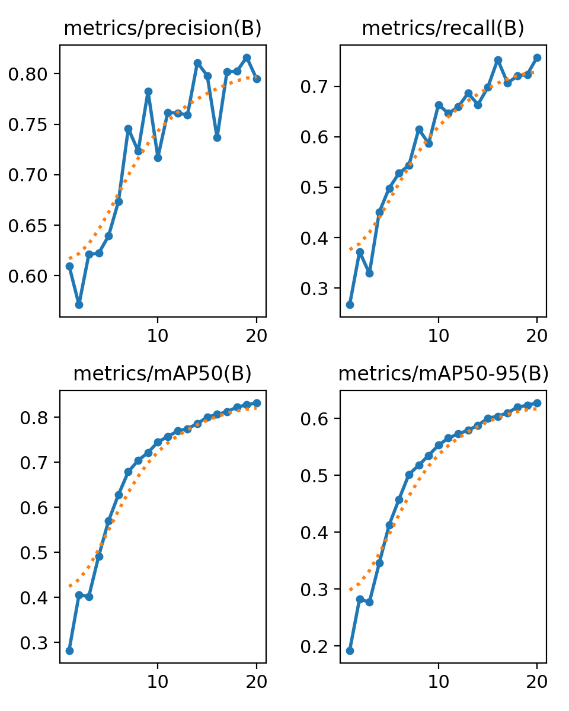

# Распознавание дорожных знаков с помощью компьютерного зрения
## Разработка мобильного приложения

Данный проект выполнен в рамках курса "Глубокое обучение на практике" от магистратуры ITMO AI Talent Hub.

## Описание используемых данных

Для обучения модели был выбран датасет [RTSD](https://www.kaggle.com/datasets/watchman/rtsd-dataset). Изображения получены с широкоформатного видеорегистратора, который снимает с частотой 5 кадров в секунду. Разрешения изображений от 1280×720 до 1920×1080. Фотографии были сделаны в разное время года (весна, осень, зима), в разное время суток (утро, день, вечер) и при различных погодных условиях (дождь, снег, яркое солнце). В наборе используется 155 знак дорожного движения, формат разметки - COCO.


## Подготовка данных для обучения
Данные, использованные для обучения представлены с разметкой COCO. Модели YOLO требуют собственый формат представления, соответственно было выполнено преобразование данных в YOLO-формат. Для преобразования использовался скрипт JSON2YOLO, представленный на [Ultralytics](https://github.com/ultralytics/JSON2YOLO). Процесс конвертации - в файле [prepare_data.ypinb](https://github.com/basil-77/itmo_deep_learning_in_practice/blob/945be13fc59cb0ba413f2665a62053d6ced7a430/prepare_data.ipynb).

## Выбор модели и обучение
Файл [yolov8s.ypinb](https://github.com/basil-77/itmo_deep_learning_in_practice/blob/945be13fc59cb0ba413f2665a62053d6ced7a430/yolov8s.ipynb)  
Поскольку обученную модель предполагается использовать в мобильном приложении в качестве критериев выбора выступали с одной стороны, достаточно приемлемая точность модели, с другой ей "легкость". По результатам экспериментов выбор был сделан в пользу 'small' (YOLOv8s) - меньшая по размеру 'n' показала недостаточную точность, а старшая и более точная 'm' была уже заметно больше и требавательнее к ресурсам.

```python
model = YOLO('yolov8s.pt')
model.info()

results = model.train(data='./trafic_signs.yaml', batch=-1, epochs=20, imgsz=640, device='0')
```
Обучение модели производилось со следующими параметрами: 
Batch-size - автовыбор;  
Размер входного изображений - 640 (руководствуясь теми же соображениями относительно легкости и скорости работы);  
Оптимизатор - автовыбор;  
Число эпох - 20.  
Использовалась GPU Nvidia RTX 3060 12Gb.  
Графики изменения метрик в процессе обучения:  
<p align="center">
 
</p>

По окончании обучения оценка метрик mAP50 и mAP50-95 составили 0,804 и 0,603 соответственно.

## Разработка MVP (мобильное приложение Android)
Использование модели в мобильном приложении требует предварительной ее конвертации в совместимый формат. В данной работе выполнена конвертация в torchscript ptl:

```python
model.export(format='torchscript')
```
```python
torchscript_model = "yolov8n.torchscript"
export_model_name = "yolov8n.torchscript.ptl"

model = torch.jit.load(torchscript_model)
optimized_model = optimize_for_mobile(model)
optimized_model._save_for_lite_interpreter(export_model_name)

print(f"mobile optimized model exported to {export_model_name}")
```

В качестве образца приложения использован шаблон PyTorch Android App, доступный на гитхаб [PyTorch Android App](https://github.com/pytorch/android-demo-app/tree/master). Шаблон разработан под версию YOLOv5. Выбранная в качестве модели восьмая версия имеет отличия в output shape - для версии 5 output shape имеет формат [1, 22500, nClasses+5], в то время как, в версии 8 формат выхода представляет собой тензор размерности [1, nClasses+4, 8400]. Данные различия в форматах потребовали изменений реализации постобработки выхода модели перед подачей в Non Maximum Supression (реализовано в [outputsToNMSPredictionsYOLO8()](https://github.com/basil-77/itmo_deep_learning_in_practice/blob/b4e4f94cb6a94bbd9fb46e1683484062ad2accf3/app/app/src/main/java/org/pytorch/demo/objectdetection/PrePostProcessor.java#L153) в модуле PrePostProcessor.java).

```java
//PrePostProcessor.java
static ArrayList<Result> outputsToNMSPredictionsYOLO8(float[] outputs,
                                                      float imgScaleX, float imgScaleY,
                                                      float ivScaleX, float ivScaleY,
                                                      float startX, float startY)
```
В результате появилась возможность использовать в приложении модели вне зависимости от версии (от YOLOv3); использование того или иного алгоритма для выполнения операций NMS в постобработке включается флагом [isYOLO8](https://github.com/basil-77/itmo_deep_learning_in_practice/blob/1667170b57812f6c8def7a0102133712454026bc/app/app/src/main/java/org/pytorch/demo/objectdetection/ObjectDetectionActivity.java#L47)

```java
// ObjectDetectionActivity.java
private static boolean isYOLO8 = true;
```
Дополнительные параметры (имя файла модели, число классов, output shape и пр.) задаются в виде:

```java
// ObjectDetectionActivity.java
private static String modelname = "best.torchscript.ptl";
private static String classesname = "classes.txt";
```
```java
// PrePostProcessor.java
private static int mOutputRow = 8400; //25200 for YOLOv5
private static int mOutputColumn = 159; // output columns for YOLOv5 (number of classes + xywh + confidence)
private static int mnumClasses = 155; // number of classes for YOLOv8
private static int mlenXYWH = 4; // xywh for YOLOv8
private static float mThreshold = 0.60f; // score above which a detection is generated
private static int mNmsLimit = 6; // limit of detection objects at the same time
```

Помимо этого был переработан основной экран (Activity) приложения и добавлена дополнительная функциональность исходя из задачи. Пороговое значение вероятности для фиксации факта детекции - 0.6  
Работа выполнена в среде Android Studio.  
Сборка приложения выполнялась под платформу API 31 (Android 12).  

## Как установить и использовать
Приложение опубликовано в RuStore и доступно для загрузки по [ссылке](https://apps.rustore.ru/app/org.pytorch.demo.objectdetection) или QR-код
<p align="center">
 
</p>

Демонстрация работы приложения в реальных условиях:

[](https://www.youtube.com/watch?v=2pB8IUU6EoA)

<object width="425" height="350">
  <param name="movie" value="http://www.youtube.com/user/wwwLoveWatercom?v=BTRN1YETpyg" />
  <param name="wmode" value="transparent" />
  <embed src="http://www.youtube.com/user/wwwLoveWatercom?v=BTRN1YETpyg"
         type="application/x-shockwave-flash"
         wmode="transparent" width="425" height="350" />
</object>
