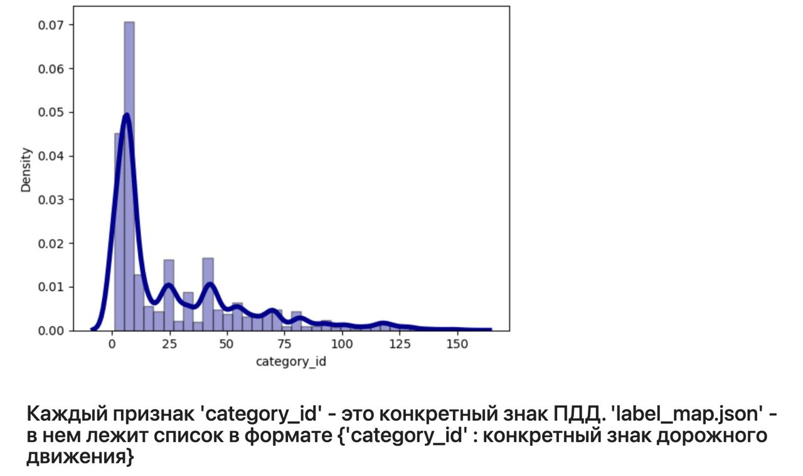
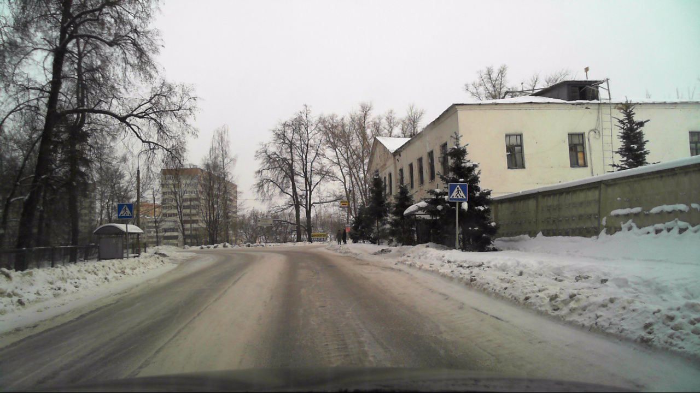
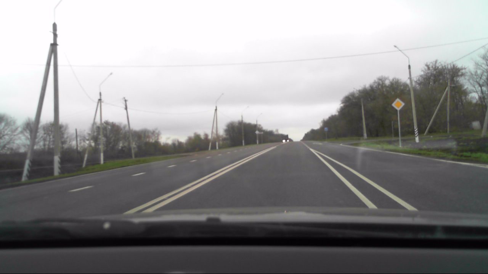
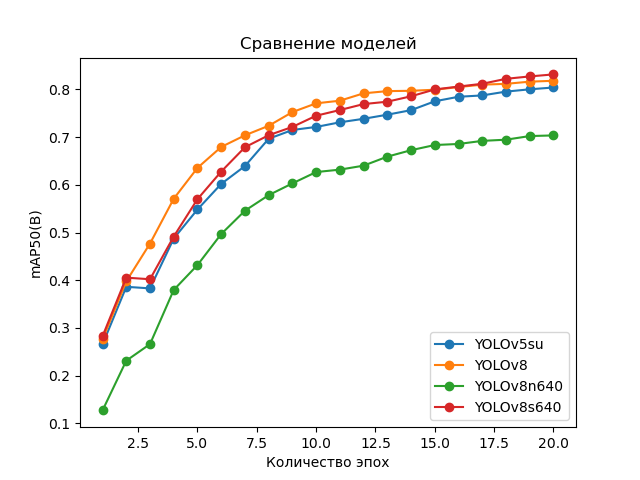
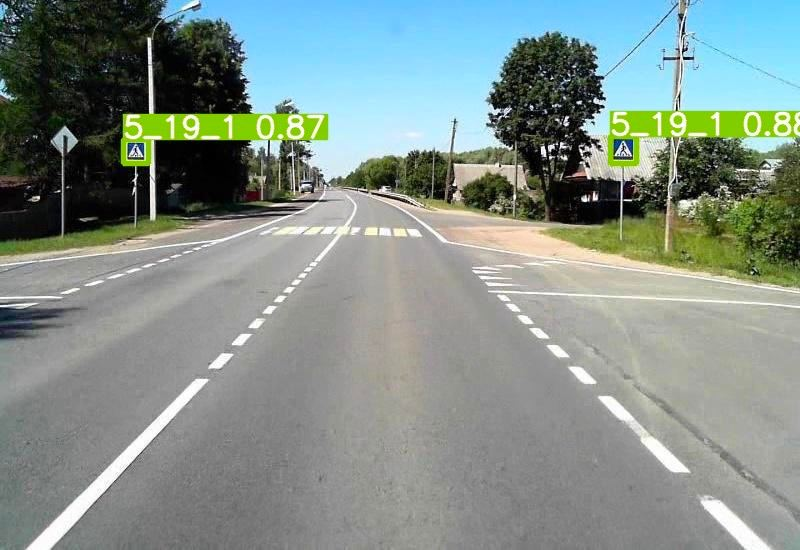
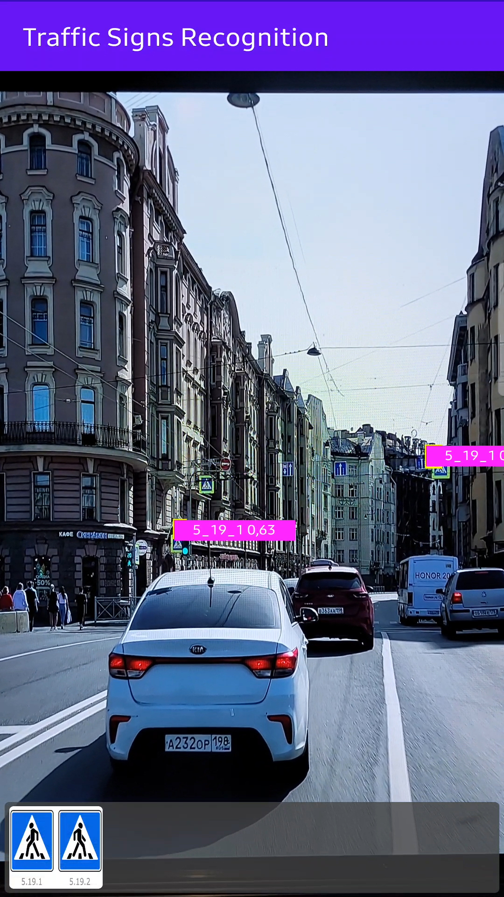
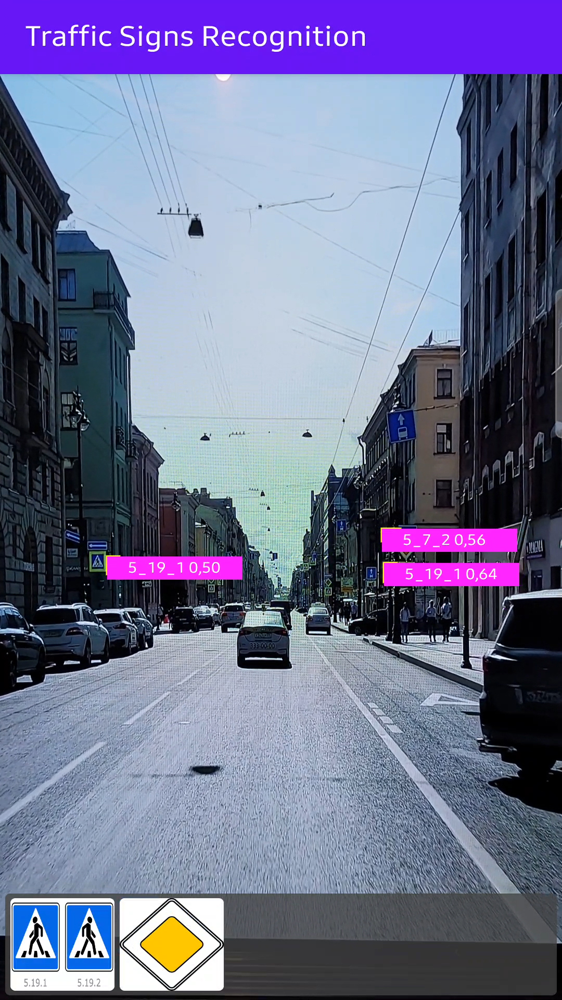
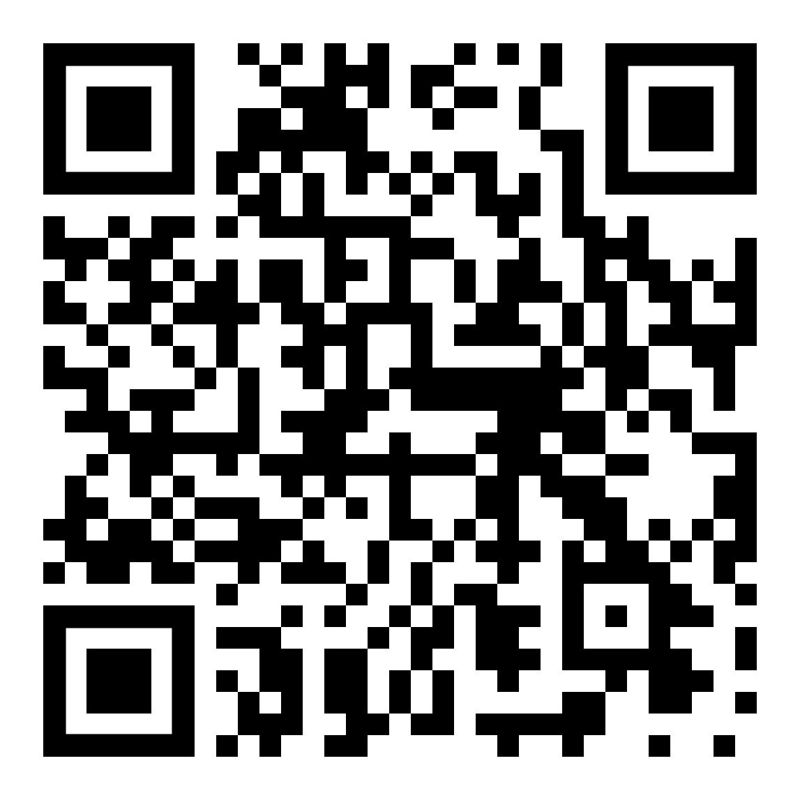

# Распознавание дорожных знаков с помощью компьютерного зрения

Данный проект выполнен в рамках курса "Глубокое обучение на практике" от магистратуры ITMO AI Talent Hub.

## Описание используемых данных

Для обучения модели был выбран датасет [RTSD](https://www.kaggle.com/datasets/watchman/rtsd-dataset). Изображения получены с широкоформатного видеорегистратора, который снимает с частотой 5 кадров в секунду. Разрешения изображений от 1280×720 до 1920×1080. Фотографии были сделаны в разное время года (весна, осень, зима), в разное время суток (утро, день, вечер) и при различных погодных условиях (дождь, снег, яркое солнце). В наборе используется 155 знак дорожного движения, формат разметки - COCO.

Подробный анализ датасета (EDA) находится в файле: "EDA_Russian_traffic_signs.ipynb"

<p align="center"></p>

Также можно увидеть что из себя представляют изображения данного датасета:

<p align="center"></p>
<p align="center"></p>

## Подготовка данных для обучения
Данные, использованные для обучения представлены с разметкой COCO. Модели YOLO требуют собственый формат представления, соответственно было выполнено преобразование данных в YOLO-формат. Для преобразования использовался скрипт JSON2YOLO, представленный на [Ultralytics](https://github.com/ultralytics/JSON2YOLO). Процесс конвертации - в файле prepare_data.ypinb.

## Эксперименты

Были взяты четыре модели, все они представлены в таблице ниже. Модели были запущены в одних условиях и обучены на 20 эпохах.
| Metrics  | YOLOv5su | YOLOv8n  | YOLOv8n640 | YOLOv8s640 |
| ------------- | ------------- | ------------- | ------------- | ------------- |
| `precision` | 0.74297  | 0.81094  | 0.72414  | 0.79494  |
| `recall`  | 0.74024  | 0.7301  | 0.63267  | 0.75753  |
| `mAP50`  | 0.80417  | 0.81824  | 0.70368  | 0.83163  |
| `mAP50-95`  | 0.60305  | 0.62838  | 0.51832  | 0.62737  |

<p align="center"></p>

## Выбор модели и обучение
Поскольку обученную модель предполагается использовать в мобильном приложении одним из основных критериев выбора (помимо актуальности и точности) являлась "легкость" - таким образом выбор был сделан в пользу версии 'nano' (YOLOv8n) - самой быстрой и маленькой из серии YOLO8.

```python
model = YOLO('yolov8n.pt')
model.info()

results = model.train(data='./trafic_signs.yaml', batch=-1, epochs=20, imgsz=640, device='0')
```
Обучение модели производилось со следующими параметрами: 
Batch-size - автовыбор;  
Размер входного изображений - 640 (руководствуясь теми же соображениями относительно легкости и скорости работы);  
Оптимизатор - автовыбор;  
Число эпох - 20.  
Использовалась GPU Nvidia RTX 3060 12Gb.  

## MVP

Итоговый продукт представляет собой веб-сервис + Android приложение.

Веб-приложение позволяет загрузить видеоряд с локального ПК или с YouTube. Если на видео будет обнаружен знак дорожного движения, то в реальном времени он будет выделен bounding-box'ом с текстовой подписью номера знака из ПДД. Например:

<p align="center"></p>

- Веб-приложение: streamlit
- Модель: YOLOv8n

### Запись функционала для веб-сервиса

- [Светло день](https://youtu.be/1IzePzng8G8)

- [Дождь ночь](https://youtu.be/OCR3bonUP80)

### Android-приложение

Приложение позволяет в реальном времени получать информацию о знаках дорожного движения в кадре смартфона. 
<p align="center"></p>

Демонстрация работы приложения в реальных условиях:

[](https://www.youtube.com/watch?v=2pB8IUU6EoA)

## Как запустить веб-сервис

### Requirements python >= 3.10
```bash
pip install -r requirements.txt
```

### Запуск из папки проекта
```bash
streamlit run app.py
```
После 1-го запуска установится доп библиотека. Нужно будет перезапустить сервис еще раз.


## Как установить и использовать Android-приложение

Приложение опубликовано в RuStore и доступно для загрузки по [ссылке](https://apps.rustore.ru/app/org.pytorch.demo.objectdetection) или QR-код
<p align="center">
 
</p>

