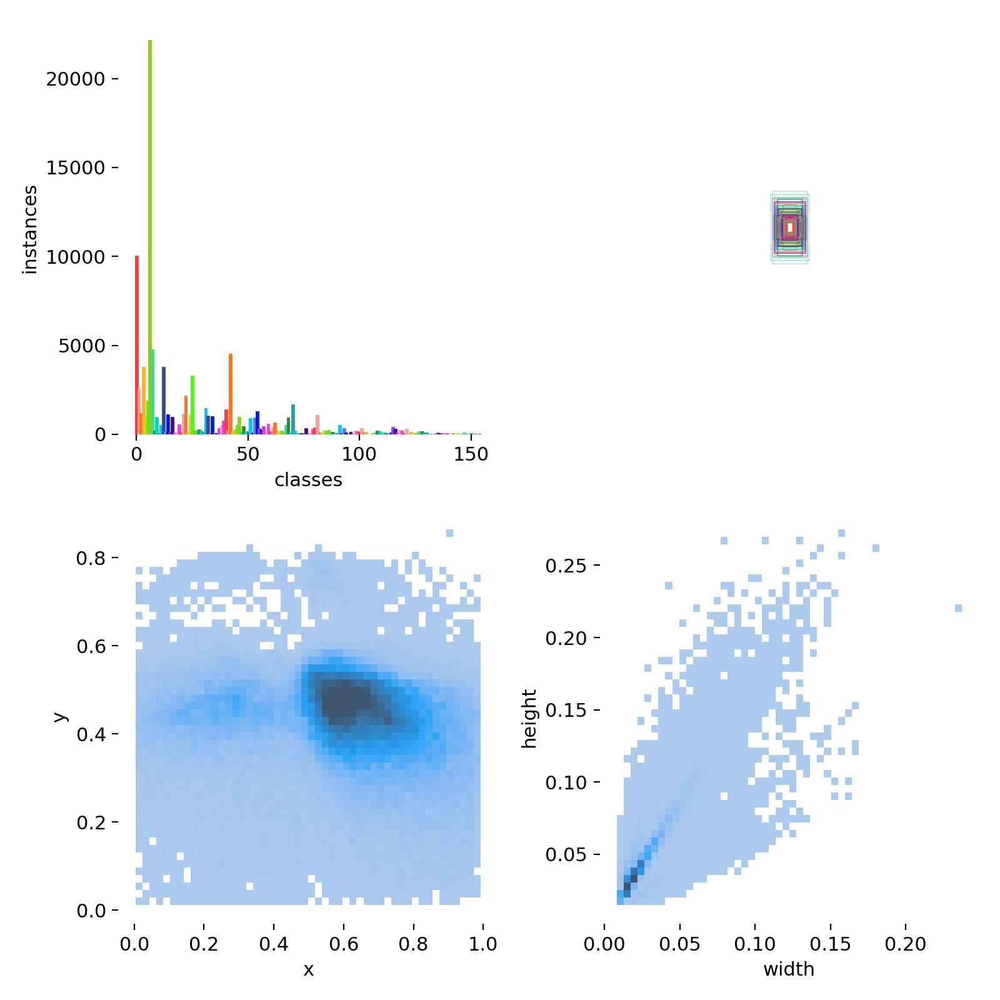
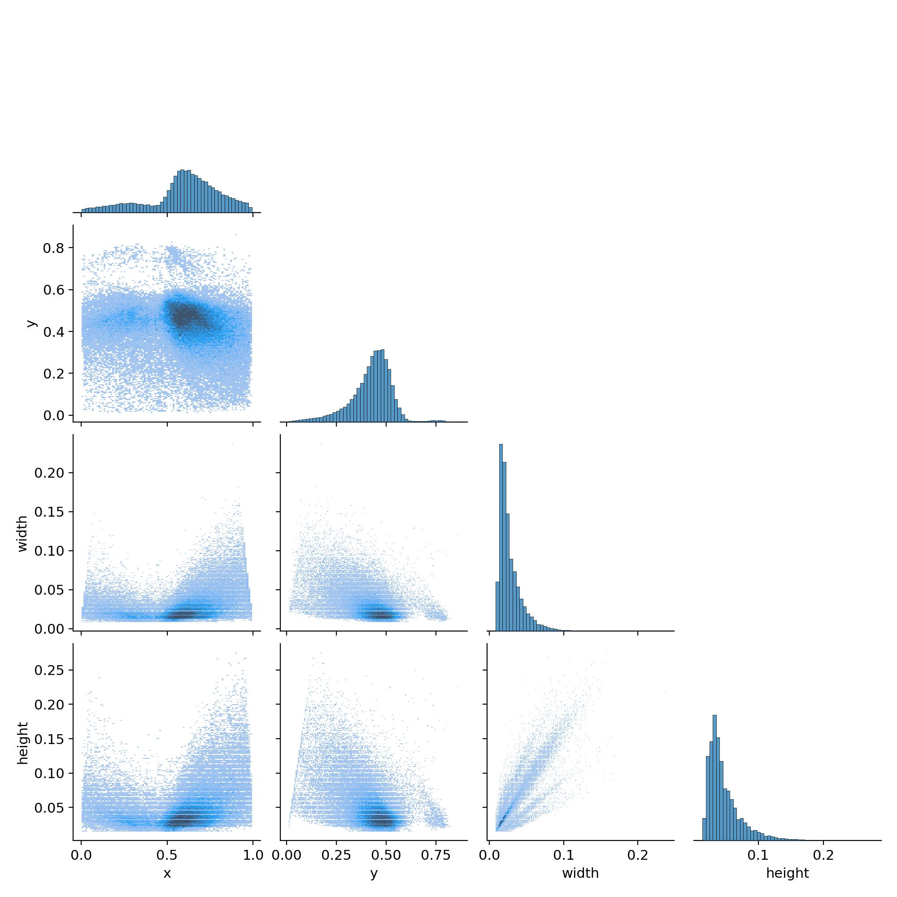
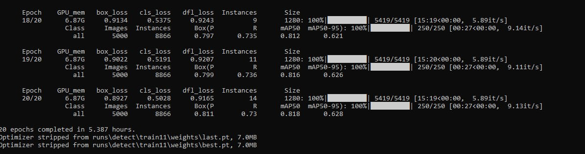
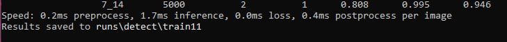
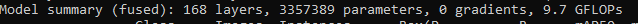
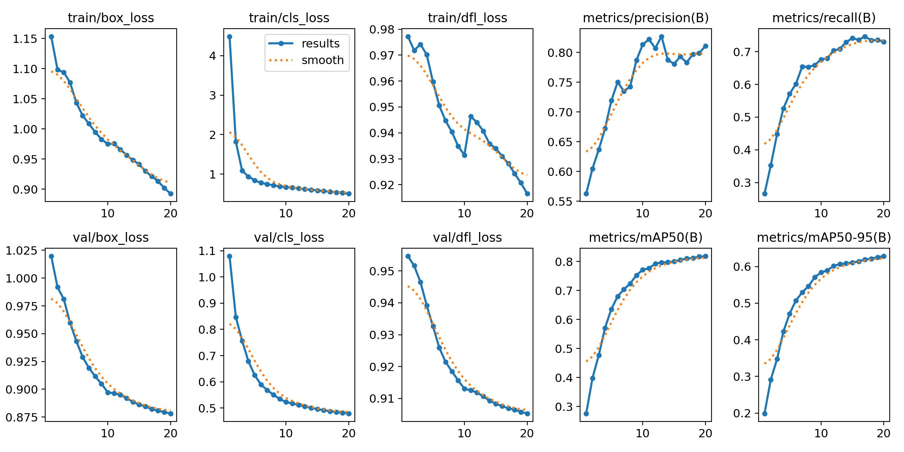
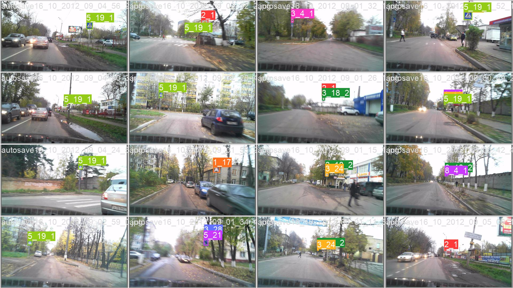

# Распознавание дорожных знаков с помощью компьютерного зрения

Данный проект выполнен в рамках курса "Глубокое обучение на практике" от магистратуры ITMO AI Talent Hub.

## Описание используемых данных

Для обучения модели был выбран датасет [RTSD](https://www.kaggle.com/datasets/watchman/rtsd-dataset). Изображения получены с широкоформатного видеорегистратора, который снимает с частотой 5 кадров в секунду. Разрешения изображений от 1280×720 до 1920×1080. Фотографии были сделаны в разное время года (ыесна, осень, зима), в разное время суток (утро, день, вечер) и при различных погодных условиях (дождь, снег, яркое солнце). В наборе используется 155 знак дорожного движения, формат разметки - COCO.

EDA датасета находится в файле: "EDA_Russian_traffic_signs.ipynb"
    

    
  

Можно увидеть, что распределение знаков в данном датасете не равномерное. Необходимо аугментирование некоторых классов.

Также можно увидеть что из себя представляют изображения данного датасета:

## Эксперименты

- Работа с данными: 

Был очищен датасет от фотографий, на которых отсутствуют знаки дорожного движения, либо фотографии дублируются, если на ней 2 и более знаков. В итоге из 179000 фотографий было оставлено  59188.

- Работа с YOLOv8:  

Были автоматически подобраны гиперпараметры SGD(lr=0.01, momentum=0.9). 

В результате обучения на 20 эпохах мы имеем следующий результат:

На валидационных данных мы можем удостовериться, что модель корректно распознает большинство знаков дорожного движения:

## MVP

Итоговый продукт представляет собой веб-сервис + Android приложение.

Веб-приложение позволяет загрузить видеоряд с локального ПК или с YouTube. Если на видео будет обнаружен знак дорожного движения, то в реальном времени он будет выделен bounding-box'ом с текстовой подписью номера знака из ПДД. Например:

- Веб-приложение: streamlit
- Модель: YOLOv8

## Как запустить

