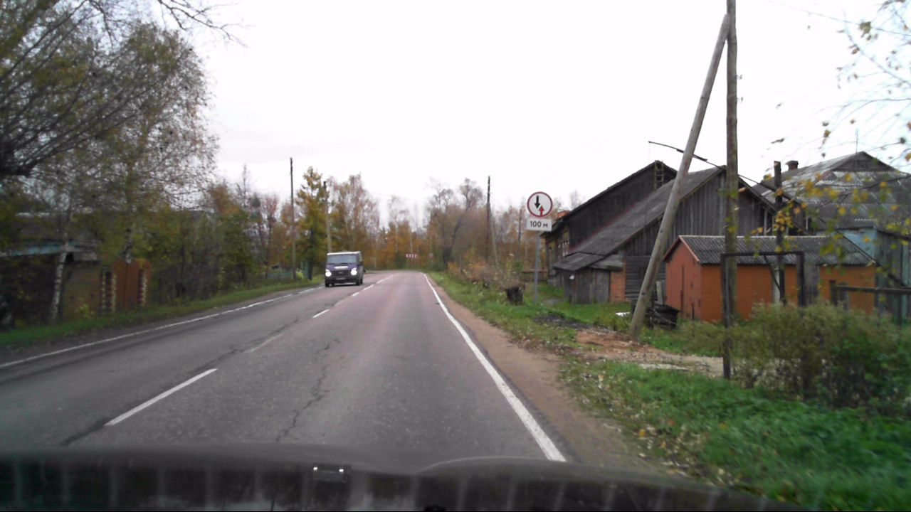

# Распознавание дорожных знаков с помощью компьютерного зрения

Данный проект выполнен в рамках курса "Глубокое обучение на практике" от магистратуры ITMO AI Talent Hub.

## Описание используемых данных

Для обучения модели был выбран датасет [RTSD](https://www.kaggle.com/datasets/watchman/rtsd-dataset). Изображения получены с широкоформатного видеорегистратора, который снимает с частотой 5 кадров в секунду. Разрешения изображений от 1280×720 до 1920×1080. Фотографии были сделаны в разное время года (весна, осень, зима), в разное время суток (утро, день, вечер) и при различных погодных условиях (дождь, снег, яркое солнце). В наборе используется 155 знак дорожного движения, формат разметки - COCO.

Можно увидеть, что распределение знаков в данном датасете не равномерное. Необходимо аугментирование некоторых классов.

Также можно увидеть что из себя представляют изображения данного датасета:

## Эксперименты

- Аугментации:
- Используемые модели: YOLOv5, YOLOv8

## MVP

Итоговый продукт представляет собой веб-сервис + Android приложение.

Веб-приложение позволяет загрузить видеоряд с локального ПК или с YouTube. Если на видео будет обнаружен знак дорожного движения, то в реальном времени он будет выделен bounding-box'ом с текстовой подписью номера знака из ПДД. Например:

- Веб-приложение: streamlit
- Модель: YOLOv8

## Как запустить

